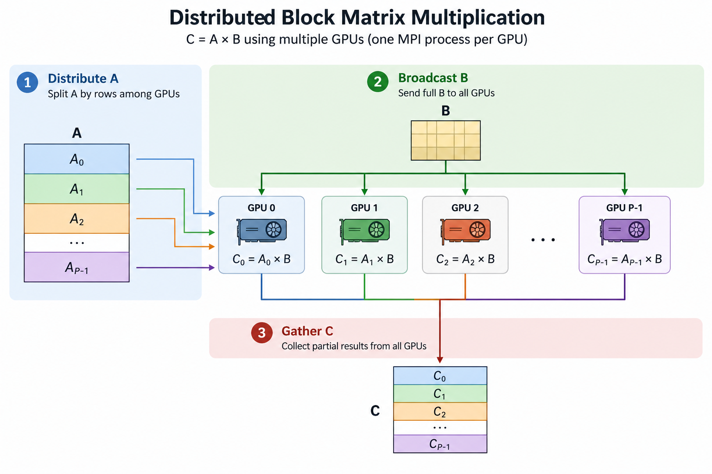

# Distributed Multi-GPU Block Matrix Multiplication

This project implements a **distributed block matrix multiplication**:

$$
C = A \times B
$$

using multiple GPUs, with **one MPI process associated with one GPU**.

The main goal is to evaluate and compare different communication mechanisms for data movement in distributed multi-GPU environments, including:

* **MPI**
* **CUDA-Aware MPI**
* **NCCL**

The application uses the same GPU computational kernel while allowing the communication mechanism for matrices **A**, **B**, and **C** to be selected independently.

---

## 1. Overview



Matrix **A** is partitioned by rows among the MPI processes/GPUs, while matrix **B** is made available to all GPUs.

Each process computes a local portion of matrix **C**:

$$
C_i = A_i \times B
$$

where:

* \($A_i$\) is the portion of matrix $A$ assigned to process/GPU \(i\);
* \($B$\) is the complete matrix $B$;
* \($C_i$\) is the partial result computed by process/GPU \(i\).

The partial matrices \($C_i$\) are then combined to obtain the complete result matrix:

$$
C =
\begin{bmatrix}
C_0 \\
C_1 \\
\vdots \\
C_{P-1}
\end{bmatrix}
$$

where \(P\) is the number of MPI processes/GPUs.

---

## 2. Parallel Execution Model

The application follows a **one MPI process per GPU** execution model.

Each MPI rank is associated with a CUDA device:

```text
MPI Rank 0      ---> GPU 0
MPI Rank 1      ---> GPU 1
MPI Rank 2      ---> GPU 2
...
MPI Rank P-1    ---> GPU P-1
```

MPI is responsible for creating and coordinating the distributed processes.

When NCCL is selected, an NCCL communicator is created among the GPUs associated with the MPI ranks.

This architecture allows the same computational kernel to be evaluated with different communication mechanisms.

---

## 3. Communication Libraries

The communication mechanism used for matrices **A**, **B**, and **C** can be independently selected using a three-character configuration string.

The available options are:

| Code | Communication Mechanism |
| ---- | ----------------------- |
| `M`  | MPI                     |
| `C`  | CUDA-Aware MPI          |
| `N`  | NCCL                    |

The three positions in the configuration string correspond to:

```text
communication_libraries[0] -> distribution of matrix A
communication_libraries[1] -> broadcast/distribution of matrix B
communication_libraries[2] -> gathering of matrix C
```

For example:

```text
NCN
```

means:

```text
Matrix A  -> NCCL
Matrix B  -> CUDA-Aware MPI
Matrix C  -> NCCL
```

Other possible configurations include:

```text
MMM
CCC
NNN
MNC
CMN
NCN
```

This design makes it possible to evaluate different combinations of communication mechanisms without modifying the computational kernel.

---

## 4. Execution Flow

The general execution flow is:

```text
             Matrix A                  Matrix B
                |                         |
                v                         v
        Scatter / Broadcast           Broadcast
                |                         |
                +-----------+-------------+
                            |
                            v
                      Multiple GPUs

                   GPU_i: C_i = A_i x B

                            |
                            v
                   Gather / AllGather C
```

The computation can be divided into three main communication stages.

### Stage 1 — Distribution of Matrix A

Matrix **A** is partitioned among the GPUs.

Each GPU receives the rows required to calculate its corresponding portion of matrix **C**.

### Stage 2 — Distribution of Matrix B

Matrix **B** must be available to every GPU participating in the computation.

Therefore, the complete matrix **B** is distributed using a broadcast operation.

### Stage 3 — Collection of Matrix C

After each GPU computes its local matrix:

$$
C_i = A_i \times B
$$

the partial results are gathered to construct the complete matrix **C**.

---

## 5. Communication Operations

### Matrix A

The distribution of matrix **A** depends on the selected communication mechanism:

| Option | Operation                                                     |
| ------ | ------------------------------------------------------------- |
| `M`    | `MPI_Scatter` using host memory                               |
| `C`    | `MPI_Scatter` directly using GPU memory                       |
| `N`    | `ncclBcast` followed by selection of the local partition of A |

### Matrix B

Matrix **B** is broadcast to all participating GPUs:

| Option | Operation                             |
| ------ | ------------------------------------- |
| `M`    | `MPI_Bcast` using host memory         |
| `C`    | `MPI_Bcast` directly using GPU memory |
| `N`    | `ncclBcast`                           |

### Matrix C

The partial results are combined using:

| Option | Operation                              |
| ------ | -------------------------------------- |
| `M`    | `MPI_Gather` using host memory         |
| `C`    | `MPI_Gather` directly using GPU memory |
| `N`    | `ncclAllGather`                        |

---

## 6. GPU Computation

The local matrix multiplication is performed by:

```cpp
ABMultiply()
```

which is defined in:

```text
mulmat_kernel.cu
```

The CUDA implementation uses **tiled matrix multiplication**.

Tiles from matrices **A** and **B** are loaded into GPU shared memory and multiplied to calculate the corresponding tile of matrix **C**.

Conceptually:

```text
Global Memory
     |
     +---- Tile A ----+
     |                |
     +---- Tile B ----+
                      |
                      v
                Shared Memory
                      |
                      v
                Tile Multiply
                      |
                      v
                 Tile of C
```

The default tile dimension is:

```cpp
#define TILE_DIM 32
```

---

## 7. Source Files

The main source files are:

```text
.
├── mmb.c
├── mulmat_kernel.cu
└── Makefile
```

### `mmb.c`

Implements:

* MPI process initialization;
* GPU selection;
* NCCL communicator initialization;
* memory allocation;
* distribution of matrices;
* selection of communication mechanisms;
* invocation of the CUDA matrix multiplication kernel;
* gathering of results;
* execution-time measurement.

### `mulmat_kernel.cu`

Implements the CUDA kernel responsible for the tiled matrix multiplication.

### `Makefile`

Compiles the MPI/CUDA application and provides execution targets for distributed multi-GPU experiments.

---

## 8. Command-Line Arguments

The executable receives three arguments:

```text
mmb <device_id> <matrix_size> <communication_configuration>
```

where:

| Argument                      | Description                                 |
| ----------------------------- | ------------------------------------------- |
| `device_id`                   | CUDA device associated with the MPI process |
| `matrix_size`                 | Dimension of the square matrices            |
| `communication_configuration` | Three-character communication configuration |

For example:

```bash
./mmb 0 8192 NCN
```

selects:

```text
CUDA Device : 0
Matrix Size : 8192 x 8192

A : NCCL
B : CUDA-Aware MPI
C : NCCL
```

In a distributed execution, each MPI process can be associated with a different CUDA device.

---

## 9. Requirements

The application requires an HPC environment with:

* NVIDIA GPUs;
* CUDA Toolkit;
* MPI implementation with CUDA support;
* NCCL;
* C/C++ compiler;
* NVIDIA CUDA compiler (`nvcc`);
* GNU Make.

For CUDA-Aware MPI experiments, the MPI implementation must support direct communication with CUDA device memory.

---

## 10. Compilation

On the SDumont environment used for the experiments, load the CUDA-aware OpenMPI module:

```bash
module load openmpi/4.1.1-cuda-11.6-ofed-5.4
```

Then compile the application:

```bash
make
```

The compilation generates the executable:

```text
mmb
```

To remove the executable and object files:

```bash
make clean
```

---

## 11. Execution

The benchmark can be executed using the provided shell script.

For example:

```bash
bash script-execution-1node-4GPUs.sh
```

The script can define:

* participating hosts;
* number of MPI processes;
* CUDA device associated with each process;
* matrix size;
* communication configuration.

A typical multi-GPU configuration follows the model:

```text
MPI Rank 0 -> Node 0 -> GPU 0
MPI Rank 1 -> Node 0 -> GPU 1
MPI Rank 2 -> Node 0 -> GPU 2
MPI Rank 3 -> Node 0 -> GPU 3
```

---

## 12. Performance Measurement

The execution time is measured using:

```cpp
MPI_Wtime()
```

The benchmark reports the average execution time for the selected matrix size and communication configuration.

Example output:

```text
Libraries=NCN
Matrix size: 8192
Time (seconds): ...
```

This makes it possible to compare configurations such as:

```text
MMM
CCC
NNN
MNC
NCN
```

for the same computational workload.

---

## 13. Benchmarking Purpose

The main purpose of this code is to evaluate the impact of **communication mechanisms and data movement** on distributed multi-GPU matrix multiplication.

Although the computational operation remains the same:

$$
C_i = A_i \times B
$$

the way data are moved between CPUs, GPUs, and remote nodes can significantly affect application performance.

The benchmark can therefore be used to investigate:

* host-to-device data movement;
* GPU-to-GPU communication;
* inter-node communication;
* MPI communication overhead;
* CUDA-Aware MPI;
* NCCL collective communication;
* communication/computation balance;
* scalability across multiple GPUs and compute nodes.

---

## 14. Research Context

Modern GPU architectures provide extremely high computational throughput, placing increasing pressure on the memory hierarchy and communication infrastructure of High-Performance Computing systems. Recent NVIDIA accelerators such as the **H200 Tensor Core GPU**, the **B200 Blackwell GPU**, the **B300 Blackwell Ultra GPU**, and heterogeneous platforms such as the **GH200 Grace Hopper Superchip** illustrate this trend, combining substantial computational capability with increasingly sophisticated high-bandwidth memory and interconnect technologies.

As the computational performance of these accelerators continues to increase, application performance becomes progressively more dependent on how efficiently data are placed, accessed, and transferred across the system. Even a very powerful GPU may remain idle or underutilized when the required data cannot be delivered at a rate sufficient to sustain its computational throughput.

This challenge becomes particularly relevant in distributed multi-GPU environments, where data movement may occur through different communication paths, including GPU memory, PCIe, NVLink/NVSwitch, CPU memory, and high-speed inter-node networks. Consequently, the location of the data and the communication mechanism selected to move it can have a significant impact on the effective performance of the application.

This benchmark provides a controlled experimental environment for investigating how different communication mechanisms affect the performance of distributed multi-GPU applications. In particular, it keeps the computational kernel unchanged while independently varying the communication strategy used for the distribution and collection of data.

This benchmark provides a foundation for studying topics such as:

**Multi-GPU Communication · Data Movement · Data Locality · Communication Topology · CUDA-Aware MPI · NCCL · NVSHMEM · NVLink/NVSwitch · High-Performance Computing**

---

## 15. Future Extensions

Possible extensions of this benchmark include:

* NVSHMEM support;
* additional GPU communication mechanisms;
* topology-aware communication;
* data-locality-aware execution;
* communication/computation overlap;
* asynchronous communication;
* automatic selection of communication libraries;
* performance modeling;
* autotuning based on matrix size and system topology.

A future communication configuration could therefore include:

```text
M = MPI
C = CUDA-Aware MPI
N = NCCL
S = NVSHMEM
```

allowing configurations such as:

```text
SSS
SNC
NCS
MSN
```

and enabling direct comparisons among different communication models for distributed multi-GPU execution.
